# Advanced MultiSelect for Dynamics 365 / Dynamics CRM 

'Advanced MultiSelect for Dynamics' is a control that represents a set of related data items (on a form) and gives an ability to associate/disassociate records of related entities in a quick and convenient way.

### You most likely are interested in this solution if

* you have Many-To-Many relationships and would like to associate / disassociate related records in a quick, convenient and flexible way using a set of appropriate checkboxes on a form
* you are using either Dynamics CRM 2016 Update 1 (**8.1**) or Dynamics 365 (**8.2**) version and you would like to have multi select / multicheckbox functionality on a form and don't want to create a lot of dedicated checkbox entity fields for each an option
* you are using the new version of Dynamics 365 (**9.0**) (_where a new multi-select functionality introduced out-of-box_) and find this out-of-box feature does not suit your needs (for example, you have to make changes in metadata each time you need to add/remove list options (instead of giving some users an ability to easily maintain the lists), you cannot support 'obsolete' options, and so forth). 

## Features
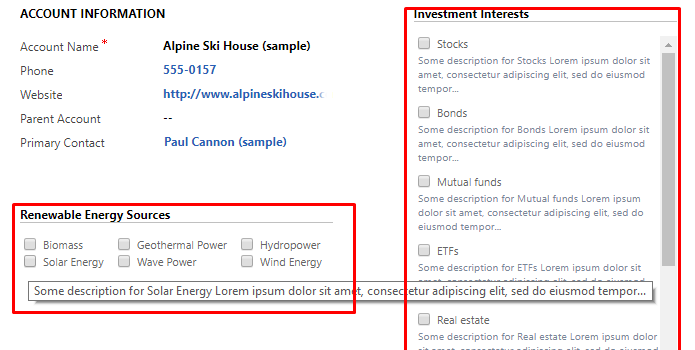

* Works for _any custom_ Many-to-Many relationships 
* Works for out-of-box Marketing List Many-to-Many relationships
* Can be easily extended to work with any other out-of-box Many-to-Many relationships

* It works smoothly for both "Update" and "_Create_" record mode
* The list of options can be customized flexibly using **Fetch Xml** or via an embedded wizard to build the query _like in 'Advanced Find'_ (you can select specific related records to show (e.g. that meet certain criteria you need))
* The list of options can be sorted flexibly using Fetch Xml
* You can use several existing templates to represent list of options on a form 
* You can create you own templates or modify existing ones as needed (html + css and using knockout template styles)
* Configuration Wizard assists you in configuring all the settings and even can embed the multi-select control into a form automatically (you do not need to make changes in form editor to add the new control on a form)

* Works respectively when a record is in read-only mode
* Works in accordance with security settings on both sides of Many-To-Many relationship  
* Can works respectively with inactive/obsolete related records (e.g. shows an inactive option in case it is related / selected already, and does not show otherwise). You can select an attribute which reflects if the option is obsolete. 
* Easy configuration of options tooltip 
* You can export / import configuration settings to transfer settings between different instances

* Works for both Online and On-Premise
* Works for Dynamics CRM 2016 Update 1 (v8.1) and Dynamics 365 (v8.2 and v9.0)

* Both Managed and Unmanaged Solutions are provided.  
* In addition to the base solution, a special DEMO solution can be installed which contains some ready-to-use examples (you can simply remove it (install Managed one)

### Does it use "supported" customization?
**All the _key functionality_ uses "supported" customization.**
There is only a small part of "unsupported" customization in the "Configuration Wizard". Via an embedded 'advanced find' feature, it assists you in specifying query to build a list of related options. As for now, it works for all versions above. However, even in case this part stops working _in further Dynamics version_, it won't cause an error and you as always will be able to specify the query via Fetch Xml directly.

# Installation and Configuration Guide

_**As for now Installation and Configuration guide / description is yet to complete (ETA is 2018-01-21)**_

## Base Solution Installation
Install a 'Base 'Advanced MultiSelect for Dynamics' Managed solution from here [Last Release](https://github.com/khorozhansky/Advanced-MultiSelect-for-Dynamics/releases/latest) 

## Demo Solution Installation
Install a DEMO Managed solution from here [Last Release](https://github.com/khorozhansky/Advanced-MultiSelect-for-Dynamics/releases/latest)  
The solution contains additional custom entity (Interests) and additional demo forms for Account and Contact entities.
Once the the solution has been installed, you need to install demo data ('Item Set' configurations and sample data in Interests entity):
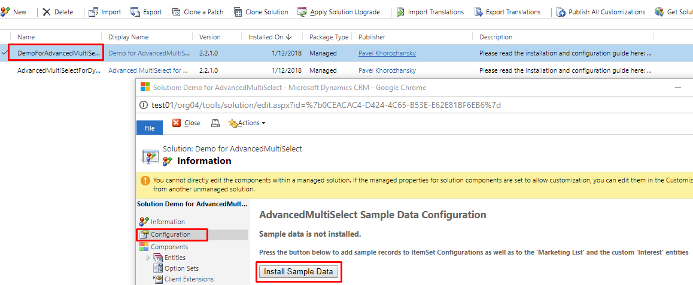

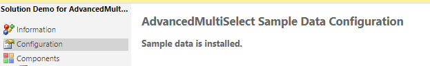

Now you can open an Account or Contact record and switch to the "DEMO" form:
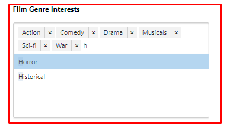

**_KNOWN ISSUE NOTE!_: _BEFORE_ REMOVING DEMO SOLUTION, remove all 'Item Set Configuration' records in the "Settings => AdvancedMultiSelect Item Set Configurations"**

## 'Item Set' Configurations
... is yet to complete ...
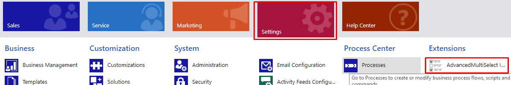
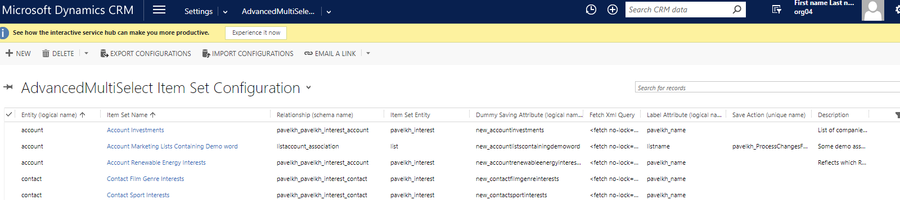
...
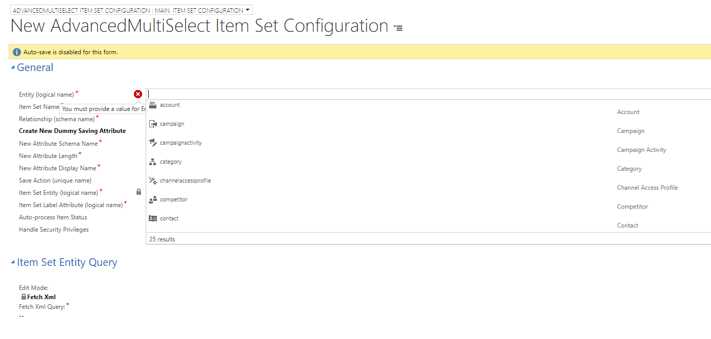
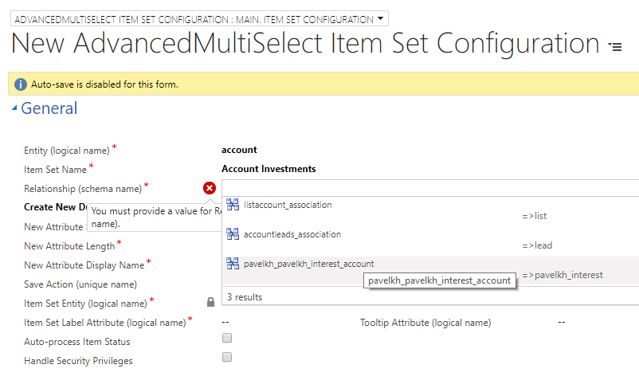
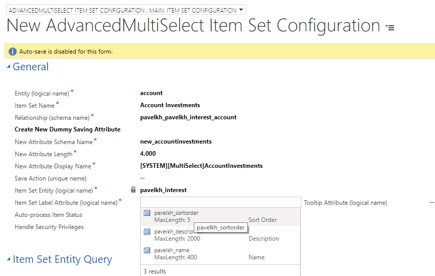
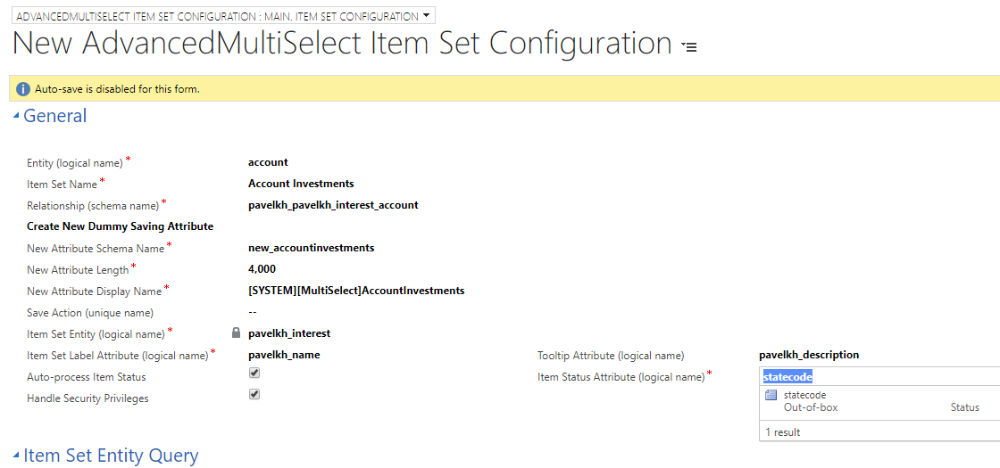
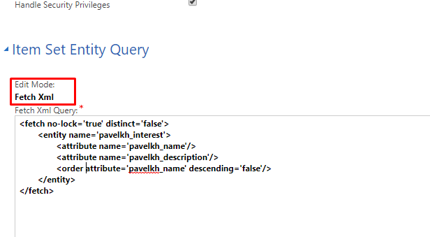
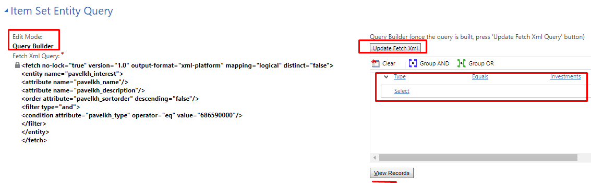
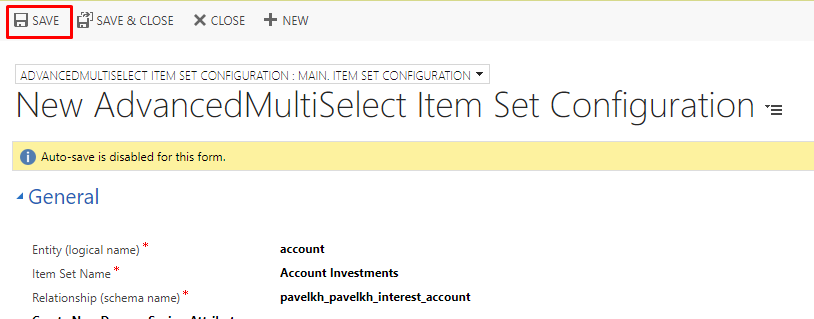
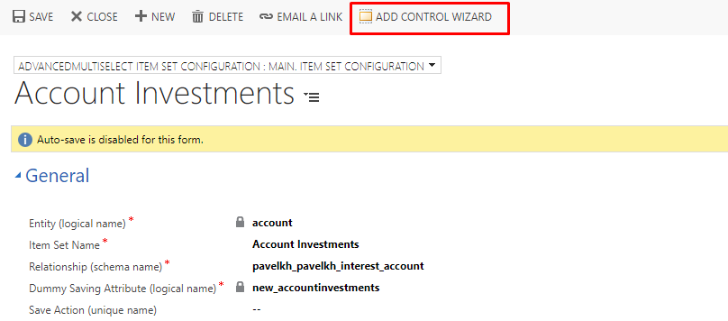

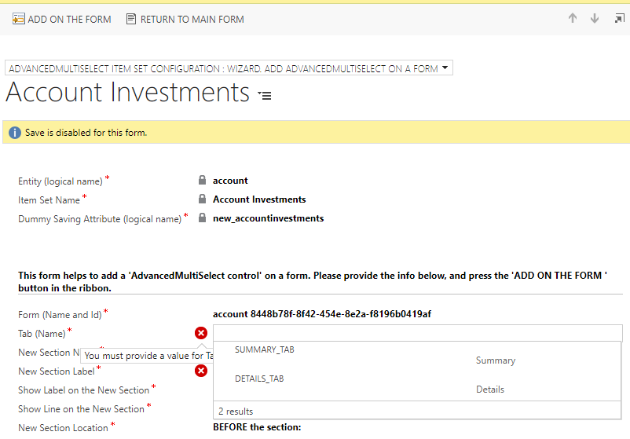
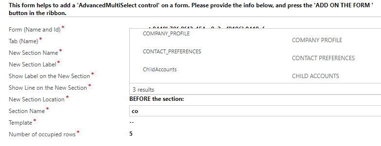
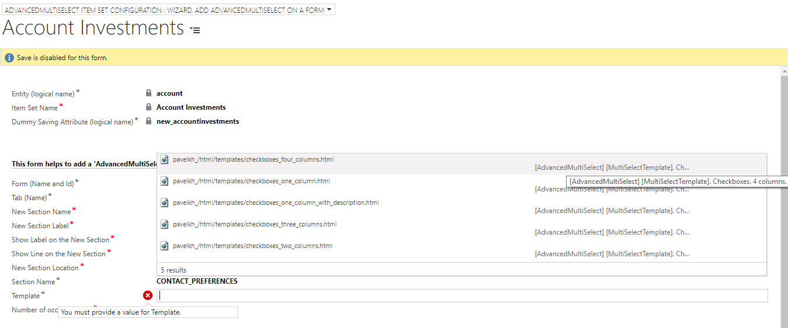
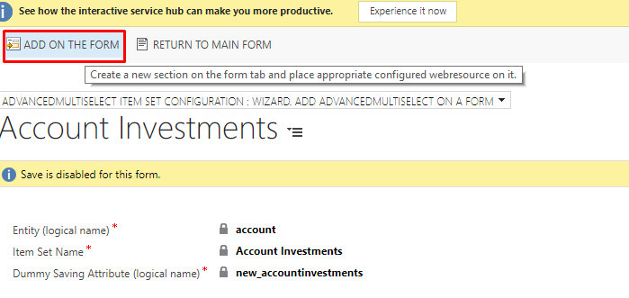
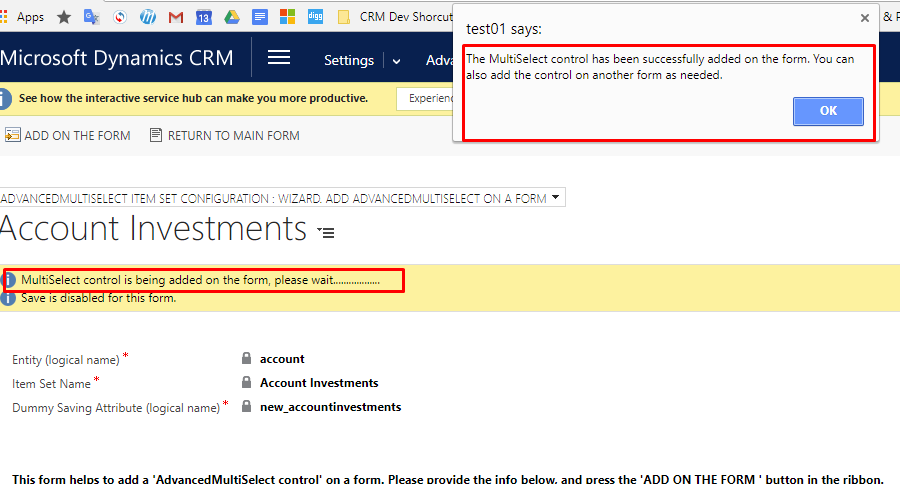

This project is a brand new revised and improved version of the https://tunemulticheckbox.codeplex.com project
